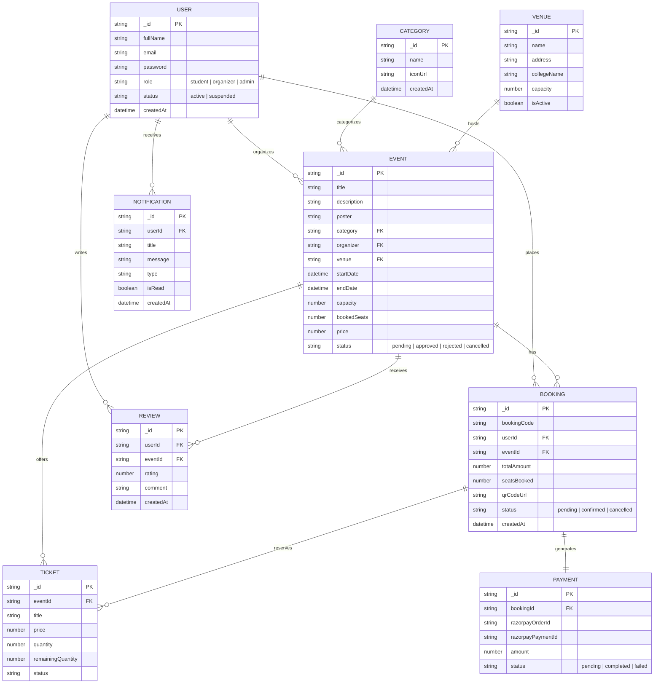

# CampusPass

## Team Members

1. **Chandan Singh**
2. **Dhirendra Singh**
3. **Rasika Lingade**
4. **Pratiksha Nimbalkar**

---

## 1. Project Introduction

The web-based **"CampusPass"** project is an automated campus event reservation and pass management system designed to streamline event discovery, seat reservation, ticket generation, and organizer management. The system enables students to search for campus events based on categories, dates, and venues, view detailed event specifications, and reserve digital event passes.

The system provides a **Quick Search** facility that allows visitors to browse available campus events and view details such as event title, category, venue location, schedule, ticket pricing, and remaining seat capacity without requiring login. However, if a user wishes to book a ticket, they must log in to their authenticated student account.

The system allows campus students to search for events available between specified dates and campus venues. It displays complete event details including event ID, title, venue name, ticket price, date, and duration. When a student chooses a particular event, the system performs a real-time availability check for seats at the selected campus venue. If seats are available, the system allows the passenger/student to proceed with booking. Otherwise, it alerts the user to select another event or session.

To complete a ticket booking, the system prompts the customer to enter registration details including full name, student email, contact number, and payment information (via Razorpay integration). The system validates the payment, generates a unique QR code pass, confirms seat allocation, and updates both the event database and user booking database in real-time.

Additionally, CampusPass incorporates an **AI Auto-Fill Assistant** powered by Google Gemini API. Event organizers can enter a natural language prompt, and the system automatically generates structured event details, selects valid backend categories and campus venues, and synthesizes poster artwork.

---

## 2. Use Case Diagram

```mermaid
graph TD
    classDef actorStyle fill:#2563eb,stroke:#1d4ed8,stroke-width:2px,color:#ffffff;
    classDef usecaseStyle fill:#f8fafc,stroke:#64748b,stroke-width:1.5px,color:#0f172a;

    subgraph CampusPass System
        UC1(Quick Search Events) ::: usecaseStyle
        UC2(View Event & Venue Details) ::: usecaseStyle
        UC3(User Authentication & Login) ::: usecaseStyle
        UC4(Check Seat Availability) ::: usecaseStyle
        UC5(Book Event Pass) ::: usecaseStyle
        UC6(Make Online Payment / Razorpay) ::: usecaseStyle
        UC7(Generate & View QR Code Pass) ::: usecaseStyle
        UC8(Submit Event Review) ::: usecaseStyle

        UC9(Create & Manage Events) ::: usecaseStyle
        UC10(AI Auto-Fill & Poster Generator) ::: usecaseStyle
        UC11(Check Venue Conflict & Capacity) ::: usecaseStyle
        UC12(View Sales & Attendance Analytics) ::: usecaseStyle

        UC13(Approve / Reject Events) ::: usecaseStyle
        UC14(Manage Categories & Venues) ::: usecaseStyle
        UC15(Manage Users & System Logs) ::: usecaseStyle
    end

    Student["Student / Passenger"] ::: actorStyle
    Organizer["Event Organizer"] ::: actorStyle
    Admin["System Admin"] ::: actorStyle

    %% Student Relationships
    Student --> UC1
    Student --> UC2
    Student --> UC3
    Student --> UC4
    Student --> UC5
    Student --> UC8

    UC5 ..> UC3 : <<include>>
    UC5 ..> UC6 : <<include>>
    UC6 ..> UC7 : <<include>>

    %% Organizer Relationships
    Organizer --> UC3
    Organizer --> UC9
    Organizer --> UC10
    Organizer --> UC12

    UC9 ..> UC11 : <<include>>

    %% Admin Relationships
    Admin --> UC3
    Admin --> UC13
    Admin --> UC14
    Admin --> UC15
```

---

## 3. Entity-Relationship (ER) Diagram



---

## 4. Environment Setup (.env)

Create a `.env` file in the `backend/` directory with the following variables:

```env
PORT=3000

MONGODB_URI=mongodb://localhost:27017/campuspass

JWT_SECRET=gjjkjfjkjdflfjudiofdnjkhiogfgmkxchandansinghdfdfjlkdfldlkdf
JWT_EXPIRES_IN=7d

EMAIL_HOST=smtp.gmail.com
EMAIL_PORT=587
EMAIL_USER=your_email@gmail.com
EMAIL_PASS=your_app_password

REDIS_HOST=127.0.0.1
REDIS_PORT=6379

CLOUDINARY_CLOUD_NAME=your_cloud_name
CLOUDINARY_API_KEY=your_api_key
CLOUDINARY_API_SECRET=your_api_secret

RAZORPAY_KEY_ID=rzp_test_xxxxxxxxx
RAZORPAY_KEY_SECRET=xxxxxxxxxxxxxxxx

CLIENT_URL=http://localhost:5173

OTP_LENGTH=6
OTP_EXPIRY_MINUTES=10

BOOKING_CODE_PREFIX=CP
QR_FOLDER=campuspass_qr
MAX_FILE_SIZE=5242880

ADMIN_NAME=Super Admin
ADMIN_EMAIL=admin@campuspass.com
ADMIN_PASSWORD=Admin@123

# Google Gemini AI API Key
GEMINI_API_KEY=your_google_gemini_api_key
```

---

## 5. How to Run the Project

### Backend Setup

```bash
cd backend
npm install
npm run dev
```

### Frontend Setup

```bash
cd client
npm install
npm run dev
```
